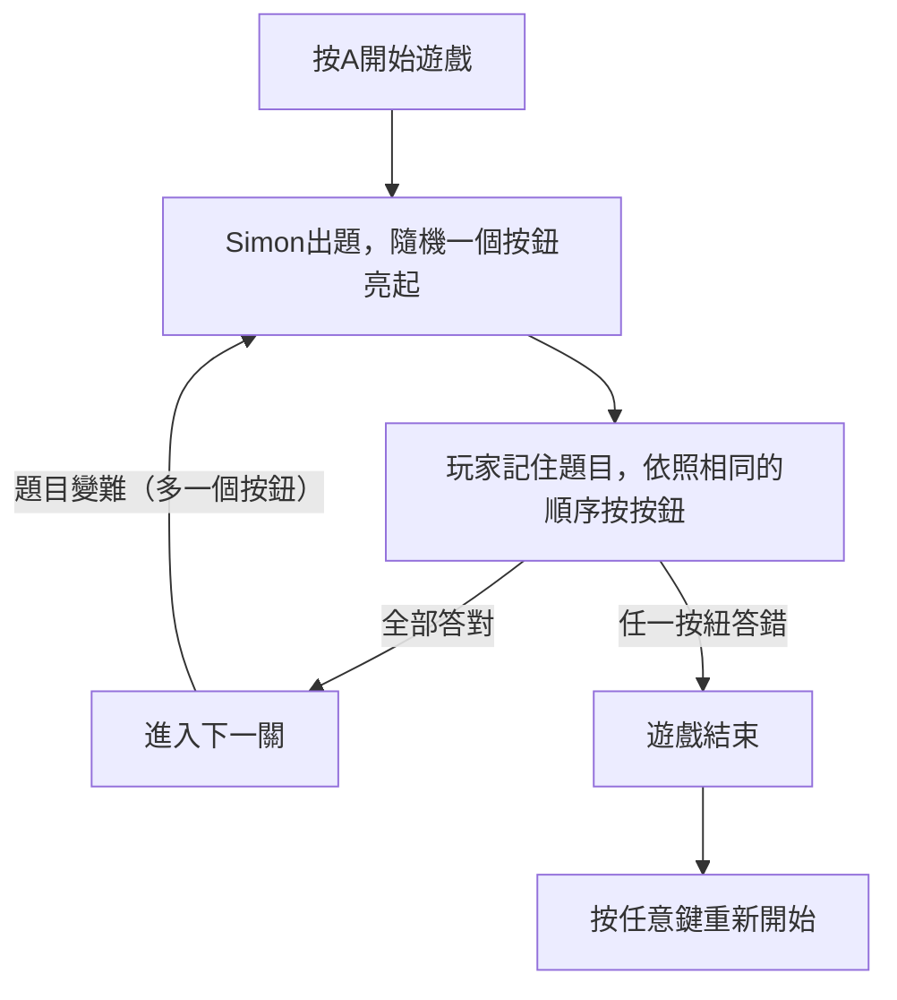

# Simon Game

為了練習前端網頁設計，用JavaScript, HTML, CSS製作而成的網頁遊戲。  
以經典桌遊Simon Game為主題，規則相同("Do what Simon says")。  
遊戲網址：[Link](https://para0229k.github.io/Siman_Game/)  


> 目錄  
> [1. 檔案結構](#1-檔案結構)  
> [2. 遊戲流程](#2-遊戲流程)  
> [3. 結果展示](#3-結果展示)  

---

## 1. 檔案結構

```
Simon_Game/
├── sounds/       # 按鈕及答錯音效
│   ├── blue.mp3
│   ├── green.mp3
│   ├── red.mp3
│   ├── wrong.mp3  
│   └── yellow.mp3
├── game.js       # 遊戲邏輯
├── index.html    # 網頁素材配置
└── style.css     # 素材外觀設定

```

---

## 2. 遊戲流程



---

## 3. 結果展示

### ▸ 初始畫面


### ▸ 遊戲中  
> 顯示操作方式和說明  


### ▸ 結束畫面  
> 遊戲進行中


  


